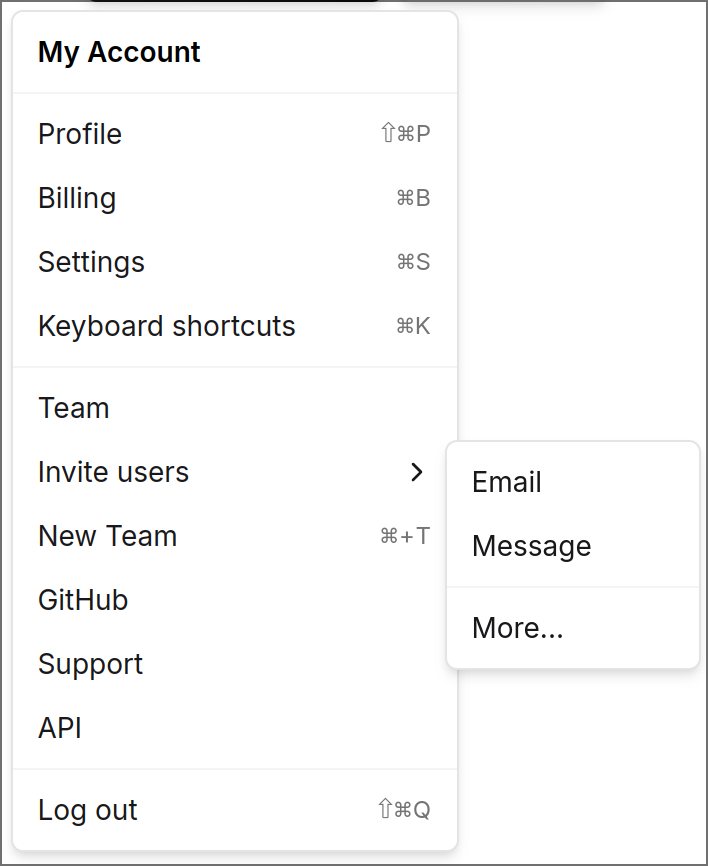

# popcicle

[](https://hex.pm/packages/popcicle)
[](https://hexdocs.pm/popcicle/)

```sh
gleam add popcicle@1
```
```gleam
import popcicle
import lustre/element/html
import lustre/attribute

pub fn main() {
    popcicle.popcicle(
        html.button([], [ // This is the button to open the popover
            html.text("Click me")
        ]),
        popcicle.UnderCenter, // This is where the popover should be positioned, more info below
        html.div([
            attribute.class("p-4 w-72 outline-none shadow-sm bg-white rounded-md border border-zinc-200 overflow-hidden")
        ], [
            html.text("My popover")
        ]),
        popcicle.Click // Wether the popover should be shown on click (popcicle.Click) or on hover (popcicle.Hover)
    )
}
```

Further documentation can be found at <https://hexdocs.pm/popcicle>.

## Are they styled by default?

No, however there are ready-made styles popovers that you can simply copy into your project and use that are based on shadcn/ui:

Previews can be found on https://popcicle.keii.dev

* [Dropdown Menu](https://github.com/dinkelspiel/popcicle/blob/master/examples/dropdown_menu.gleam)
 


## Do i have to use Lustre

Yes.

